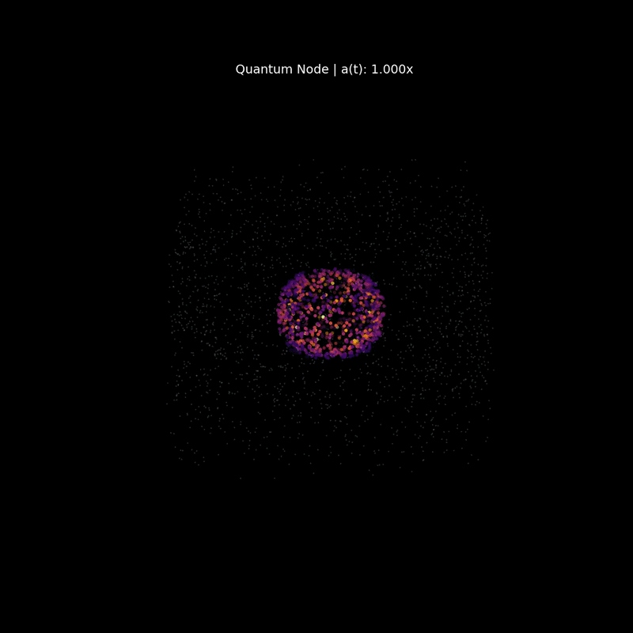

[](https://doi.org/10.5281/zenodo.19822536)
[](https://colab.research.google.com/drive/1eB89a0FUgZUQL5Qs_uTuEzmeXdH88ar4?usp=sharing)
[](https://opensource.org/licenses/Apache-2.0)

# The Bandyopadhyay Cyclic Manifold: Dual-Component Engine (v31.2)
**Lead Architect:** Rupayan Bandyopadhyay

A high-performance, JAX-accelerated cosmological engine simulating a non-singular cyclic universe. This version represents a fundamental architectural leap, fusing **Collisionless Dark Matter (PM)** with **Hydrodynamic Baryonic Fluid (SPH)** to model an emergent "Quantum Bounce" driven by physical fluid pressure rather than scripted triggers.

---

## 📄 Abstract
The Bandyopadhyay Cyclic Manifold (v31.2) discards artificial "white hole" logic flags in favor of first-principles emergent physics. Utilizing a hybrid **Particle-Mesh (PM)** and **Smoothed Particle Hydrodynamics (SPH)** architecture, the engine simulates a dual-sector universe where Dark Matter provides the gravitational scaffolding for a Baryonic core. By integrating the **FLRW metric tensor** and a non-linear **Schwarzschild-de Sitter Lapse ($\alpha$)**, the simulation demonstrates that a non-singular bounce is a natural consequence of baryonic fluid reaching peak compression limits.

## 🚀 Architectural Evolution: v31.2 vs. Previous v13.0
The v31.2 engine marks a complete paradigm shift from the earlier v13.0 String-Star Manifold repository. The core upgrades emphasize the transition from **prescriptive logic** to **emergent physical properties**:

*   **From Unified Matter to Dual-Component:** While v13.0 treated all particles identically, v31.2 splits the universe into two distinct physical sectors. Dark Matter operates purely via gravity on a high-speed PM grid, while Baryons interact hydrodynamically via SPH. 
*   **From Scripted Triggers to Emergent Bounces:** v13.0 forced a bounce when density hit a hard-coded Planck threshold (the "White Hole Flag"). In v31.2, this is entirely removed. The bounce is mathematically emergent, occurring solely when the Baryonic internal fluid pressure ($P = k\rho^2$) violently overcomes the gravitational Dark Matter crush.
*   **From Linear Scaling to the FLRW Metric:** Spacetime in v31.2 is no longer a static box; spatial coordinates are coupled directly to the dynamic scale factor $a(t)$, allowing for genuine Hubble Flow expansion post-bounce.

## 🔄 The Dual-Component Cycle
The simulation operates on a tripartite energy-sector loop, where total universal information $I_{total}$ is strictly conserved across the bounce:

$$I_{total} = I_{dark} + I_{baryon} + I_{vacuum} \equiv 1.000000$$

| Sector | Description | Kinematics |
| :--- | :--- | :--- |
| **Dark Matter** | Collisionless point masses driving global gravity. | $O(N \log N)$ FFT-PM Solver |
| **Baryonic Fluid** | Collisional matter generating hydrodynamic pressure. | $O(N^2)$ SPH Interaction |
| **Vacuum** | Dynamic Dark Energy pool ($\Lambda$) driving expansion. | FLRW Metric Scaling |

## 💻 Live Interactive Simulation
A complete, high-fidelity interactive environment is hosted on Google Colab, optimized for TPU-accelerated execution.

**👉 [Run the v31.2 Engine at the Quantum Node](https://colab.research.google.com/drive/1eB89a0FUgZUQL5Qs_uTuEzmeXdH88ar4?usp=sharing)**

*(Note: To modify physical parameters or scale the particle count, click **File > Save a copy in Drive** and ensure your runtime is set to **TPU**).*

## ⚙️ v31.2 Core Innovations
*   **Emergent Hydrodynamic Bounce:** Gravity is countered by a vectorized SPH kernel calculating real-time inter-particle repulsion ($P = k\rho^2$).
*   **Adiabatic Relaxation Layer:** Implements a custom velocity-damping phase for $t < 250$ to solve the "Initial Condition Shock" paradox, allowing stable fluid accretion within Dark Matter halos.
*   **Hybrid-Precision FFT Solver:** Utilizes `float32` for $128^3$ mesh potential solutions while maintaining `float64` for particle states to preserve absolute unitarity.
*   **Detailed Telemetry Logging:** Professional-grade output tracking metric lapse ($\alpha$), baryon pressure, and scale factor, with automated export to `quantum_node_telemetry.csv`.

## 🎥 Cinematic 3D Visualization & Telemetry



*The 3D render above demonstrates the collisionless Dark Matter scaffolding (ghosted nodes) driving the gravitational crunch, while the Hydrodynamic Baryonic core (color-mapped) generates the pressure spike that triggers the emergent Quantum Bounce.*

The v31.2 engine features high-fidelity terminal logging with self-explanatory descriptive tooltips for each epoch, complementing the visual data:
```text
EPOCH 0200 | [ <<< CRUNCHING <<< ]
  ├─ Scale Factor a(t)  : 1.0863 x   |████░░░░░░░░░░░░░░░░░░░░|
  │  (Current size of the universe relative to the initial state)
  ├─ Baryon Pressure    :   25.91 bits
  │  (Inter-particle repulsion preventing total singularity collapse)
  ├─ Metric Lapse (α)   : 0.841203
  │  (Gravitational time dilation; lower values indicate higher density)
  └─ Quantum Bounces    : 0
     (Number of successful non-singular phase transitions completed)
