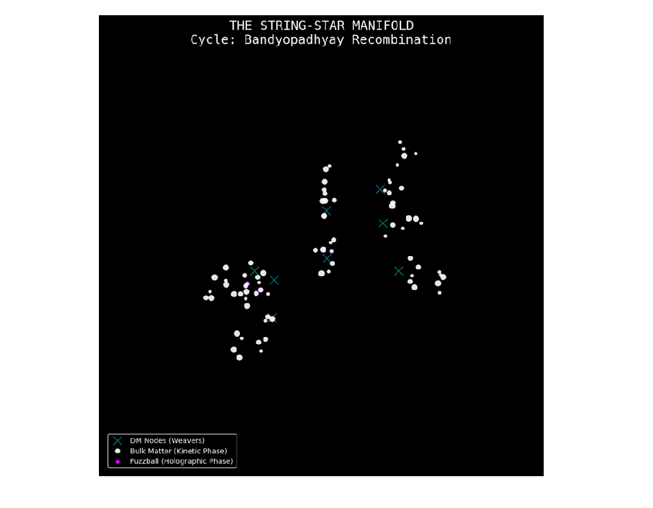
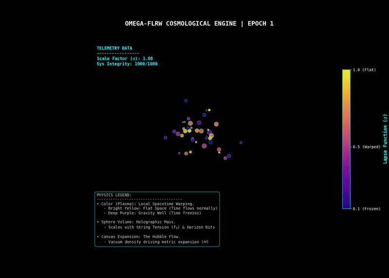

[](https://doi.org/10.5281/zenodo.19822536)
[](https://colab.research.google.com/drive/1jU_KBP_PVUUk4sagIxJsA4NnRKCN2LBh?usp=sharing)
[](https://opensource.org/licenses/Apache-2.0)

# String-Star Manifold: Omega-FLRW Cosmological Engine
**Lead Architect:** Rupayan Bandyopadhyay

A JAX-accelerated simulation of unitary information conservation, dark energy expansion, and relativistic spacetime warping via the String-Star-Cycle.



## 📄 Abstract
The String-Star Manifold is a discrete computational model designed to simulate a unitary, closed-loop universe. It discards the continuous spacetime manifold in favor of an $O(N \log N)$ informational ledger. By implementing a nodal recombination mechanism—the **Bandyopadhyay-Cycle**—this engine demonstrates that 100% of universal information is preserved across bulk accretion events, Fuzzball horizon winding, and Hawking evaporation.

## 🔄 The Bandyopadhyay-Cycle
This simulation introduces a tripartite information-phase loop. For a system with total information $I_{total}$, the ledger is strictly defined and permanently conserved as:

$$I_{total} = I_{bulk} + I_{horizon} + I_{vacuum}$$

| Phase | Description | Logic |
| :--- | :--- | :--- |
| **Bulk** | Kinetic matter active in the 3D manifold. | Particle mass $m \ge 1$ |
| **Horizon** | Bits trapped on a Fuzzball string surface. | $S = A/4$ (Bekenstein-Hawking) |
| **Vacuum** | Ambient radiation in the Dark Matter pool. | Available for Recombination |

## 🚀 Live Interactive Simulation
You do not need to install anything to verify this engine. A complete, interactive environment with 3D cinematic visualization is hosted on Google Colab. 

**👉 [Run the Simulation in your Browser Here](https://colab.research.google.com/drive/1jU_KBP_PVUUk4sagIxJsA4NnRKCN2LBh?usp=sharing)**

*(Note: The interactive environment has been securely configured for public access as a Viewer-only resource. To tweak the physical parameters—such as `STRING_TENSION` or `TARGET_DENSITY`—click **File > Save a copy in Drive** and ensure your runtime is set to TPU).*

## ⚙️ Core Physics & Features
* **Nodal Dark Matter:** 8 weaver nodes act as anchors for continuous information recombination out of the vacuum pool.
* **JAX-Accelerated TPU Engine:** High-performance, horizontally scalable N-body simulation utilizing stretchy spatial hashing to maintain $O(N \log N)$ complexity.
* **Dynamic Quintessence (FLRW Metric):** Bypasses the special relativity speed limit by applying the Hubble Flow directly to the spatial grid, scaling the expansion mathematically based on the vacuum energy density.
* **Relativistic Time Dilation:** Utilizes a Parameterized Post-Newtonian (PPN) Lapse Function ($\alpha$) to physically slow and freeze the local kinematics of particles as they approach massive gravity wells.
* **Fuzzball String Tension:** Eliminates classical point-singularities, replacing infinite event horizons with dynamic, tangible string surfaces that physically expand as they absorb microstates.
* **Gravitational Radiation:** Orbital decay is governed strictly by the Einstein Quadrupole Formula (no arbitrary drag).
* **ER=EPR Integration:** Tracks entangled particle pairs across event horizons (Spooky Action at a distance).
* **Bekenstein-Hawking Thermodynamics:** Closes the cosmological loop by simulating the evaporation of mature Fuzzballs, redepositing integer bits back into the vacuum pool to fuel future expansion.

## 🎥 Cinematic 3D Visualization

The Colab notebook includes a custom `matplotlib` 3D animation renderer that visually maps the mathematics of the simulation into a high-fidelity video file. 

When you run the visualization cell, the engine generates an MP4 animation demonstrating three explicit physical phenomena:
* **The Hubble Flow (Spatial Expansion):** The coordinate grid dynamically stretches outward, visually proving the metric expansion of space.
* **Gravitational Time Dilation (Color Mapping):** Particles transition from bright yellow ($\alpha = 1.0$, flat space) to deep purple ($\alpha \to 0.1$) as their local flow of time is physically slowed by Fuzzball gravity wells.
* **The Holographic Shift (Volume Mapping):** The graphical volume of the nodes mathematically scales with `STRING_TENSION`, showing the literal tangibility of the string microstates on the Fuzzball surface.

## 🔒 Integrity Logs
The system's mathematical unitarization has been verified at a 1000-bit scale over extended epoch runs with **zero information loss**. Regardless of the phase state, the universal ledger holds absolute:
$$I_{total} = I_{bulk} + I_{horizon} + I_{vacuum}$$

## 💻 Local Installation (For JAX/TPU Development)
If you wish to run the engine locally or on a dedicated computing cluster:
```bash
git clone [https://github.com/YOUR_USERNAME/String-Star-Manifold.git](https://github.com/YOUR_USERNAME/String-Star-Manifold.git)
cd String-Star-Manifold
pip install jax jaxlib numpy pandas matplotlib
python engine.py
